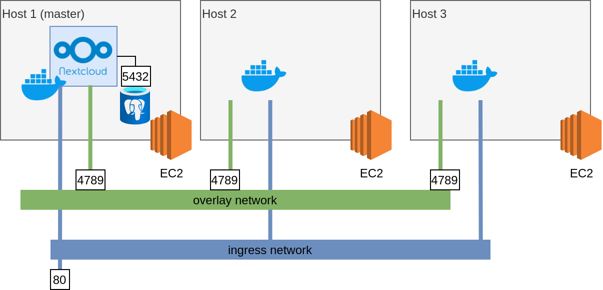

# Run Nextcloud as container on AWS
Pratical test of infra and DevOps




## How to run
Requirements:
python


1 - Install Ansible and boto

```
sudo apt update
sudo apt install software-properties-common
sudo add-apt-repository --yes --update ppa:ansible/ansible
sudo apt install ansible -y
pip install boto
```

2 - Execute Ansible Playbook

There is two types of instalations. The first is master VM installation and the second is simple VM installation. In the master VM, the playbook will install and configure a Postgresql dtabase. The master instalation will be run when you add -e master_node=true in the command line.

```
ansible-playbook aws_vm_provising.yml -e @localhost.yml --ask-vault-pass
```

3 - SSH to VM to finish configuration

3.1 On the master VM:

3.1.1 Init docker swarm

```
docker swarm init
```
Save the text returned by command. It will anble new hosts to join on the cluster.

3.1.1 Create a overlay network

```
docker network create --opt encrypted --driver overlay --attachable data-network
```

3.1.2 Configure Postgresql database

Edit file /etc/postgres/< version >/main/postgresql.conf and add the line

```
listen_address <ip_of_host> 
```
Edit file /etc/postgres/< version >/main/pg_hba.conf and add the line

```
host    nextcloud   nextcloud   <ip-docker-container>   trust
```

Restart postgresql

```
/etc/init.d/postgresql restart
```
